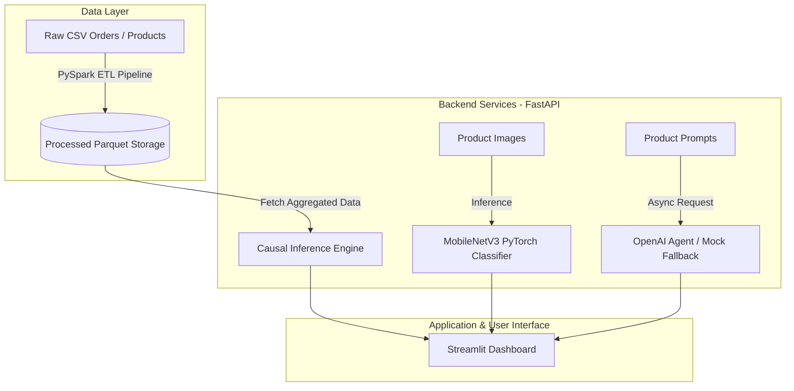

# Multimodal E-Commerce Intelligence Platform 🚀

**2026-09-23**

Production-ready analytical system for e-commerce integrating **GenAI (OpenAI)**, **Computer Vision (PyTorch)**, **Data Engineering (PySpark ETL)**, and **Causal Inference**.

---

## 🏗️ Architecture & Data Flow

---

## 🛠️ Tech Stack

| Category | Technologies |
| :--- | :--- |
| **Backend & API** | Python 3.11, FastAPI, Uvicorn, Pydantic |
| **Generative AI** | OpenAI API, Async Client, Fallback Mock Architecture |
| **Computer Vision** | PyTorch, torchvision (`MobileNetV3-Small`), PIL |
| **Data Engineering** | Apache Spark (PySpark), Pandas, PyArrow, Parquet |
| **Frontend & UI** | Streamlit, Requests |
| **DevOps & CI/CD** | Docker, GitHub Actions, `pytest` |

---

## ✨ Key Features

1. **Multimodal Product Analysis (GenAI Agent)**:
   * Extracts key product features from raw descriptions.
   * Categorizes items and suggests optimal price bounds with dynamic fallback mock support.

2. **Image Detection & Classification (Computer Vision)**:
   * Lightweight `MobileNetV3-Small` PyTorch model for real-time item verification optimized for low-memory environments (512MB RAM).

3. **Data Engineering & ETL (PySpark)**:
   * PySpark ETL pipeline for ingesting, schema-cleaning, joining, and persisting high-volume order data to Parquet format.

4. **Causal Inference**:
   * Estimates sales lift based on discounts and customer rating impact.

---

## 🔗 Links & Repository

* **GitHub Repository:** [View on GitHub](https://github.com/Vados182/multimodal-ecommerce-intelligence)